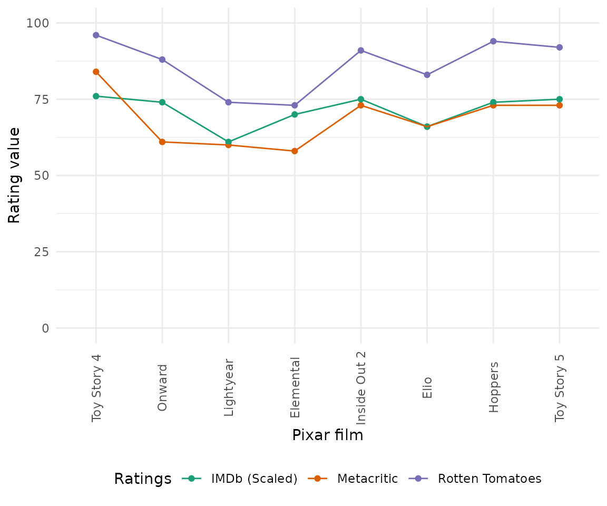
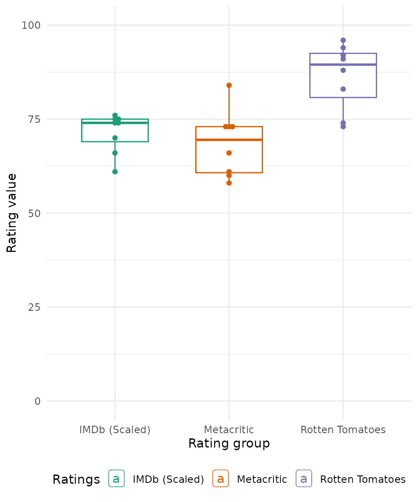

# Pixar Film Ratings

## Overview

This vignette is to recreate an analysis on Pixar ratings that can be
found [here](https://pierrecom.github.io/Pixars%20Movies.html).

## Setup

``` r

library(pixarfilms)
library(dplyr)
#> 
#> Attaching package: 'dplyr'
#> The following objects are masked from 'package:stats':
#> 
#>     filter, lag
#> The following objects are masked from 'package:base':
#> 
#>     intersect, setdiff, setequal, union
library(tidyr)
library(forcats)
library(ggplot2)
library(irr)
#> Loading required package: lpSolve
```

## Data wrangling

Before we can visualize our data, let’s wrangle our data to help us
visualize it later on.

``` r

df <-
  public_response %>%
  select(-cinema_score, -ends_with("counts")) %>%
  mutate(imdb_score = imdb_score * 10) %>%
  mutate(film = fct_inorder(film)) %>%
  pivot_longer(cols = c("rotten_tomatoes_score", "metacritic_score", "imdb_score"),
               names_to = "ratings",
               values_to = "value") %>%
  mutate(ratings = case_when(
    ratings == "imdb_score" ~ "IMDb (Scaled)",
    ratings == "rotten_tomatoes_score" ~ "Rotten Tomatoes",
    ratings == "metacritic_score" ~ "Metacritic"
  )) %>%
  drop_na()
```

## Ratings over time

Their first plot was comparing the Pixar films’ ratings over time.

``` r

df %>%
  ggplot(aes(x = film, y = value, col = ratings)) +
  geom_point() +
  geom_line(aes(group = ratings)) +
  scale_color_brewer(palette = "Dark2") +
  labs(x = "Pixar film", y = "Rating value") +
  guides(col = guide_legend(title = "Ratings")) +
  theme_minimal() +
  scale_y_continuous(limits = c(0, 100)) +
  theme(axis.text.x = element_text(angle = 90, vjust = 0.5),
        legend.position = "bottom") 
```



**Verdict**: people and critics generally agree that Cars 2 was not as
good as the other Pixar films.

## Ratings by rating group

Next, let’s group the rating categories to see if there is a consistency
across.

``` r

df %>%
  ggplot(aes(x = ratings, y = value, col = ratings)) +
  geom_boxplot(width = 1.75 / length(unique(df$ratings))) +
  ggbeeswarm::geom_beeswarm() +
  ggrepel::geom_label_repel(
    data = . %>% filter(film == "Cars 2" ),
    aes(label = film),
    point.padding = 0.5,
    nudge_x = 0.1
  ) +
  scale_color_brewer(palette = "Dark2") +
  guides(col = guide_legend(title = "Ratings")) +
  labs(x = "Rating group", y = "Rating value") +
  ylim(c(0, 100)) +
  theme_minimal() +
  theme(legend.position = "bottom") 
```



**Verdict**: people at Rotten Tomatoes generally like Pixar films more
than Metacritic and IMDb. The exception to this is Cars 2, which is
consistently lowly rated.

## Rating consistency

Are the groups statistically consistent? Let’s perform [an interclass
correlation](https://en.wikipedia.org/wiki/Intraclass_correlation) among
the different critic groups.

``` r

public_response %>%
  select(-c(film, cinema_score), -ends_with("counts")) %>%
  drop_na() %>%
  icc(model = "twoway", type = "consistency")
#>  Single Score Intraclass Correlation
#> 
#>    Model: twoway 
#>    Type : consistency 
#> 
#>    Subjects = 8 
#>      Raters = 11 
#>    ICC(C,1) = 0.0971
#> 
#>  F-Test, H0: r0 = 0 ; H1: r0 > 0 
#>     F(7,70) = 2.18 , p = 0.0461 
#> 
#>  95%-Confidence Interval for ICC Population Values:
#>   -0.011 < ICC < 0.429
```

**Verdict**: with a null hypothesis that all critic groups are not
consistent, for the 28 Pixar films we have data for all critic groups,
all groups are consistent in rating Pixar films (p \< 0.001).

## Session information

``` r

sessionInfo()
#> R version 4.6.1 (2026-06-24)
#> Platform: x86_64-pc-linux-gnu
#> Running under: Ubuntu 24.04.4 LTS
#> 
#> Matrix products: default
#> BLAS:   /usr/lib/x86_64-linux-gnu/openblas-pthread/libblas.so.3 
#> LAPACK: /usr/lib/x86_64-linux-gnu/openblas-pthread/libopenblasp-r0.3.26.so;  LAPACK version 3.12.0
#> 
#> locale:
#>  [1] LC_CTYPE=C.UTF-8       LC_NUMERIC=C           LC_TIME=C.UTF-8       
#>  [4] LC_COLLATE=C.UTF-8     LC_MONETARY=C.UTF-8    LC_MESSAGES=C.UTF-8   
#>  [7] LC_PAPER=C.UTF-8       LC_NAME=C              LC_ADDRESS=C          
#> [10] LC_TELEPHONE=C         LC_MEASUREMENT=C.UTF-8 LC_IDENTIFICATION=C   
#> 
#> time zone: UTC
#> tzcode source: system (glibc)
#> 
#> attached base packages:
#> [1] stats     graphics  grDevices utils     datasets  methods   base     
#> 
#> other attached packages:
#> [1] irr_0.85         lpSolve_5.6.23   ggplot2_4.0.3    forcats_1.0.1   
#> [5] tidyr_1.3.2      dplyr_1.2.1      pixarfilms_0.2.1
#> 
#> loaded via a namespace (and not attached):
#>  [1] gtable_0.3.6       jsonlite_2.0.0     compiler_4.6.1     Rcpp_1.1.2        
#>  [5] tidyselect_1.2.1   ggbeeswarm_0.7.3   jquerylib_0.1.4    systemfonts_1.3.2 
#>  [9] scales_1.4.0       textshaping_1.0.5  yaml_2.3.12        fastmap_1.2.0     
#> [13] R6_2.6.1           labeling_0.4.3     generics_0.1.4     knitr_1.51        
#> [17] htmlwidgets_1.6.4  ggrepel_0.9.8      tibble_3.3.1       desc_1.4.3        
#> [21] RColorBrewer_1.1-3 bslib_0.12.0       pillar_1.11.1      rlang_1.3.0       
#> [25] cachem_1.1.0       xfun_0.60          S7_0.2.2           fs_2.1.0          
#> [29] sass_0.4.10        otel_0.2.0         cli_3.6.6          withr_3.0.3       
#> [33] pkgdown_2.2.1      magrittr_2.0.5     digest_0.6.39      grid_4.6.1        
#> [37] beeswarm_0.4.0     lifecycle_1.0.5    vipor_0.4.7        vctrs_0.7.3       
#> [41] evaluate_1.0.5     glue_1.8.1         farver_2.1.2       ragg_1.5.2        
#> [45] rmarkdown_2.31     purrr_1.2.2        tools_4.6.1        pkgconfig_2.0.3   
#> [49] htmltools_0.5.9
```
