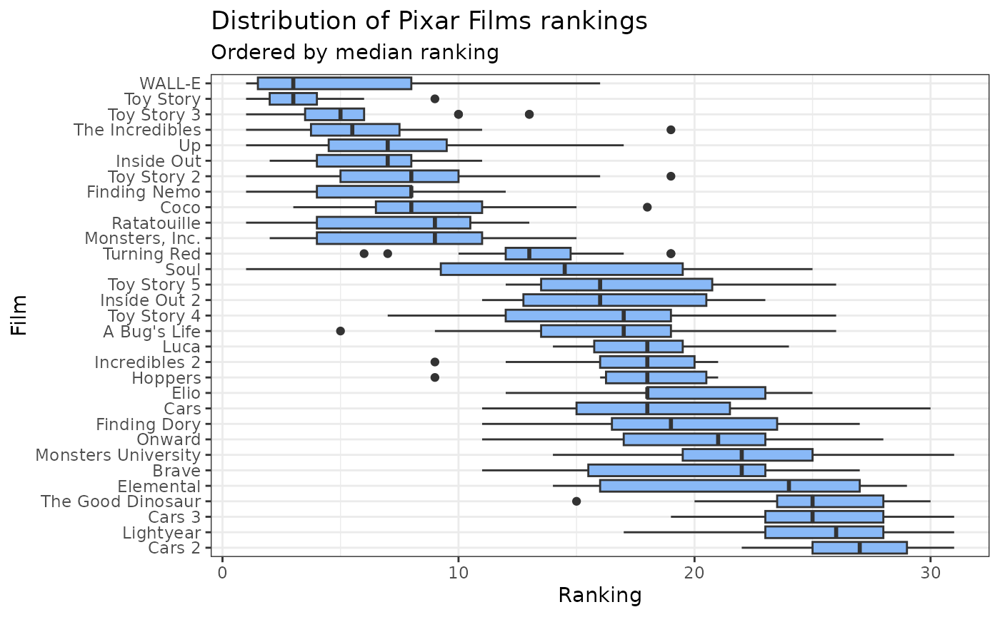
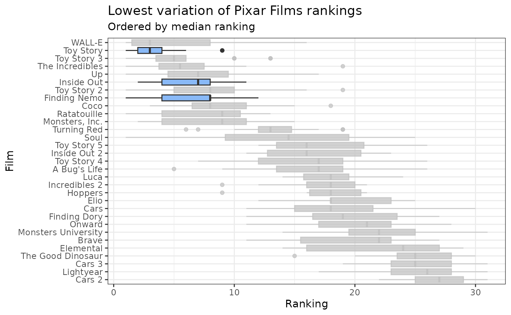
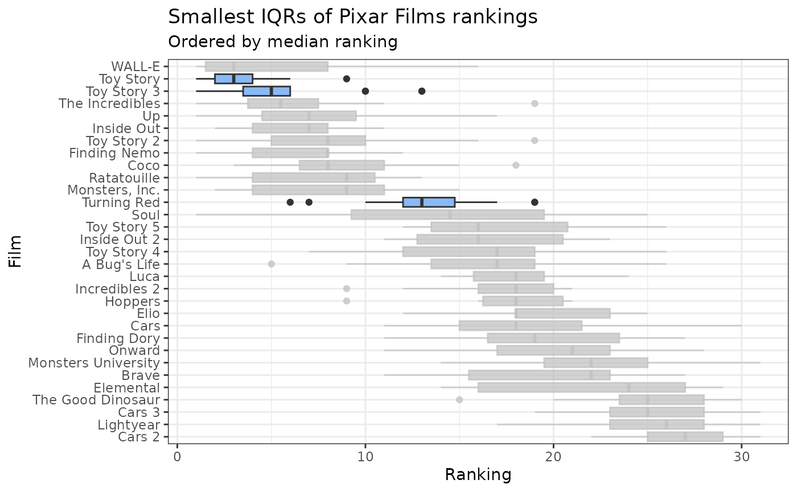
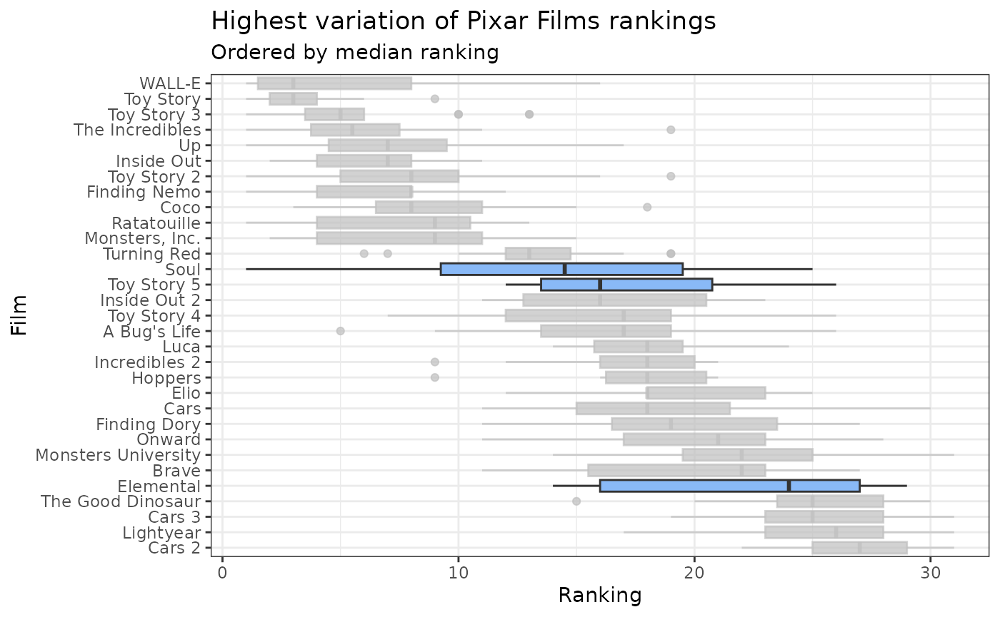
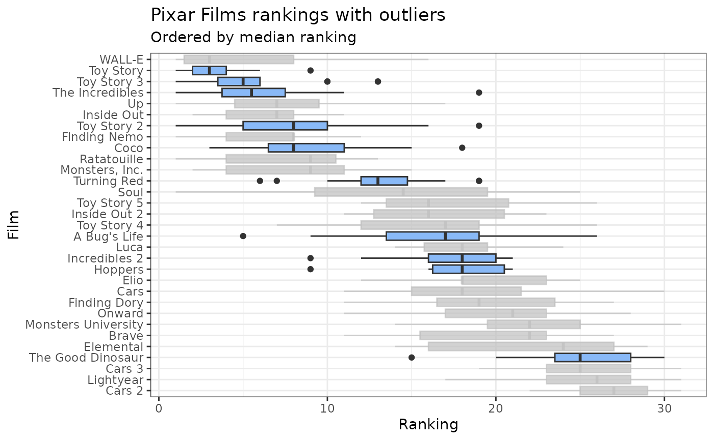

# Exploration of Pixar Films Rankings

``` r

library(pixarfilms)
library(ggplot2)
library(dplyr)
#> 
#> Attaching package: 'dplyr'
#> The following objects are masked from 'package:stats':
#> 
#>     filter, lag
#> The following objects are masked from 'package:base':
#> 
#>     intersect, setdiff, setequal, union
library(forcats)
library(gghighlight)
```

## Distribution of rankings

``` r

pixar_rankings |>
  mutate(film = fct_reorder(film, ranking, .fun = median, .desc = TRUE)) |>
  ggplot(aes(x = film, y = ranking)) +
  geom_boxplot(fill = "#89B9F7") +
  coord_flip() +
  labs(
    title = "Distribution of Pixar Films rankings",
    subtitle = "Ordered by median ranking",
    x = "Film",
    y = "Ranking"
  ) +
  theme_bw()
```



``` r


# Save out for presentation use
# ggsave(
#   here::here("vignettes", "pixar_rankings.png"),
#   width = 8,
#   height = 5
# )
```

## Highlighting variation in rankings

A couple of things we notice from the boxplot above are that some films
have a low variance in their rankings, while others have a higher
variance. We can calculate the standard deviation of the rankings for
each film to see which films have the lowest variance.

``` r

summary_ranks <-
  pixar_rankings |>
  group_by(film) |>
  summarize(
    sd = sd(ranking),
    q1 = quantile(ranking, 0.25),
    q3 = quantile(ranking, 0.75),
    iqr = IQR(ranking),
    lower_bound = q1 - 1.5 * iqr,
    upper_bound = q3 + 1.5 * iqr
  ) |>
  arrange(sd)
print(summary_ranks)
#> # A tibble: 31 × 7
#>    film             sd    q1    q3   iqr lower_bound upper_bound
#>    <chr>         <dbl> <dbl> <dbl> <dbl>       <dbl>       <dbl>
#>  1 Toy Story      2.04   2     4    2          -1           7   
#>  2 Finding Nemo   2.93   4     8    4          -2          14   
#>  3 Inside Out     2.95   4     8    4          -2          14   
#>  4 Luca           2.96  15.8  19.5  3.75       10.1        25.1 
#>  5 Cars 2         3.02  25    29    4          19          35   
#>  6 Incredibles 2  3.42  16    20    4          10          26   
#>  7 Toy Story 3    3.58   3.5   6    2.5        -0.25        9.75
#>  8 Cars 3         3.63  23    28    5          15.5        35.5 
#>  9 Coco           3.69   6.5  11    4.5        -0.25       17.8 
#> 10 Ratatouille    3.72   4    10.5  6.5        -5.75       20.2 
#> # ℹ 21 more rows
```

We can see that Toy Story, Finding Nemo, Inside Out, Luca, Cars 2,
Incredibles 2 have the lowest variance in their rankings. We can
highlight these films in the boxplot above to see how they compare to
the other films.

``` r

pixar_rankings |>
  mutate(film = fct_reorder(film, ranking, .fun = median, .desc = TRUE)) |>
  ggplot(aes(x = film, y = ranking)) +
  geom_boxplot(fill = "#89B9F7") +
  coord_flip() +
  gghighlight(
    film %in% pull(head(arrange(summary_ranks, sd), 3), film),
    use_group_by = FALSE
  ) +
  labs(
    title = "Lowest variation of Pixar Films rankings",
    subtitle = "Ordered by median ranking",
    x = "Film",
    y = "Ranking"
  ) +
  theme_bw()
```



``` r


# Save out for presentation use
# ggsave(
#   here::here("vignettes", "pixar_rankings.png"),
#   width = 8,
#   height = 5
# )
```

We can also see that Toy Story, Toy Story 3, Turning Red, Luca, The
Incredibles have the smallest IQR ranges in their rankings. We can
highlight these films in the boxplot above to see how they compare to
the other films.

``` r

pixar_rankings |>
  mutate(film = fct_reorder(film, ranking, .fun = median, .desc = TRUE)) |>
  ggplot(aes(x = film, y = ranking)) +
  geom_boxplot(fill = "#89B9F7") +
  coord_flip() +
  gghighlight(
    film %in% pull(head(arrange(summary_ranks, iqr), 3), film),
    use_group_by = FALSE
  ) +
  labs(
    title = "Smallest IQRs of Pixar Films rankings",
    subtitle = "Ordered by median ranking",
    x = "Film",
    y = "Ranking"
  ) +
  theme_bw()
```



``` r


# Save out for presentation use
# ggsave(
#   here::here("vignettes", "pixar_rankings.png"),
#   width = 8,
#   height = 5
# )
```

Now let’s highlight the highest variation in rankings. We can see that
Soul, Elemental, Toy Story 5, Toy Story 4, WALL-E have the highest
variance in their rankings. We can highlight these films in the boxplot
above to see how they compare to the other films.

``` r

pixar_rankings |>
  mutate(film = fct_reorder(film, ranking, .fun = median, .desc = TRUE)) |>
  ggplot(aes(x = film, y = ranking)) +
  geom_boxplot(fill = "#89B9F7") +
  coord_flip() +
  gghighlight(
    film %in% pull(head(arrange(summary_ranks, desc(sd)), 3), film),
    use_group_by = FALSE
  ) +
  labs(
    title = "Highest variation of Pixar Films rankings",
    subtitle = "Ordered by median ranking",
    x = "Film",
    y = "Ranking"
  ) +
  theme_bw()
```



``` r


# Save out for presentation use
# ggsave(
#   here::here("vignettes", "pixar_rankings.png"),
#   width = 8,
#   height = 5
# )
```

Now let’s highlight the outliers in the rankings.

``` r

outlier_films <-
  pixar_rankings |>
  left_join(summary_ranks, by = "film") |>
  filter(ranking < lower_bound | ranking > upper_bound) |>
  distinct(film)

pixar_rankings |>
  mutate(film = fct_reorder(film, ranking, .fun = median, .desc = TRUE)) |>
  ggplot(aes(x = film, y = ranking)) +
  geom_boxplot(fill = "#89B9F7") +
  coord_flip() +
  gghighlight(
    film %in% outlier_films$film,
    use_group_by = FALSE
  ) +
  labs(
    title = "Pixar Films rankings with outliers",
    subtitle = "Ordered by median ranking",
    x = "Film",
    y = "Ranking"
  ) +
  theme_bw()
```



``` r


# Save out for presentation use
# ggsave(
#   here::here("vignettes", "pixar_rankings.png"),
#   width = 8,
#   height = 5
# )
```
